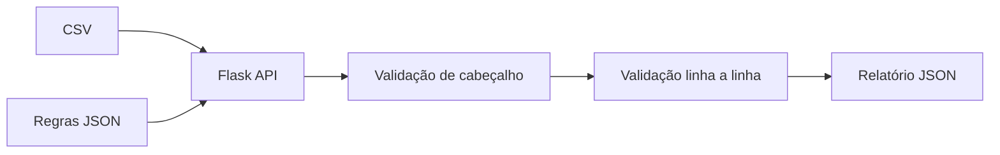

# CSV Rules Validator Demo

[](https://github.com/Caue-Macrini/csv-rules-validator-demo/actions)

API genérica para validar arquivos CSV com regras declaradas em JSON. A demonstração mostra como transformar uma conferência manual extensa em um processo repetível, testável e auditável.

> Projeto independente de portfólio. As colunas, regras e dados são fictícios e não reproduzem modelos informacionais institucionais.

## Arquitetura



## Regras suportadas

- Campos obrigatórios.
- Tipos `integer`, `decimal`, `email` e `text`.
- Lista de valores permitidos.
- Comprimento máximo.
- Erros com linha, coluna e mensagem.

## Executar

```bash
python -m venv .venv
source .venv/bin/activate  # Windows: .venv\Scripts\activate
pip install -r requirements.txt
flask --app app run
```

```bash
curl -F "csv=@sample.csv" -F "rules=@rules.example.json" http://localhost:5000/api/validate
```

## Testes e Docker

```bash
pytest -q
docker build -t csv-rules-validator-demo .
docker run --rm -p 5000:5000 csv-rules-validator-demo
```

## Próximas evoluções

- Processamento assíncrono para arquivos grandes.
- Persistência de relatórios e trilha de auditoria.
- Interface React e autenticação.
- Métricas, tracing e rate limiting.

## Licença

MIT.
